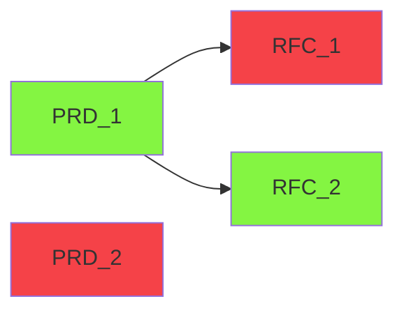

# smart-proposals
A smart contract application for voting on `PRDs` and `RFCs` documents, based on the [Stellar blockchain](https://stellar.org/), [Soroban](https://soroban.stellar.org/) Rust smart contract SDK.

## Motivation

* Learning smart contracts. Not only from a code point of view, but from an architectural one. A "real" use case.
* Provide a web3 solution that allows voting on PRDs and RFCs.
* It could even be a serious smart contract app some day or get inspiration for one.

## Defining project idea

Many times a decision process is spread across multiple mutable channels without clearly being registered anywhere in an immutable, trusted way. The fact of not having specific rules, also means the fairness of the process is in doubt.

Also, sometimes the process of identifying a problem is completely individualized in one person, without having a chance to collectively decide on its designation phase.

The following diagram tries to demonstrate how the voting process goes in cascade by first defining the problem in a `PRD` and later, if voting is positive, create the relevant `RFC` and vote on it. Once the first `RFC` is approved, the process ends. 

See more definitions invariants below.

### Actors

* `PRD` (Product Requirement Document) - This is more about product. Where we define the goals or features of the thing we want to achieve. It be also a problem definition that needs a solution on this application context.

* `RFC` (Request for comments) - An `RFC` should be linked to a `PRD` on this application. Is the technical solution (RFC) proposal to a problem (PRD).

* `Author` - The author of a `PRD` or an `RFC`. Represented by an address or account.

* `Voter` - An address or account, that could vote in processes.
  
* `VL` (`Voter` list) - A set of addresses or accounts that can participate in voting operations.

### Invariants

* A `PRD` can exist standalone.
* A `PRD` can be collectively and uniquely voted by a `VL`. The vote can be positive or negative.
* A `PRD` can have only one linked `RFC` in "open voting" state at a given time, once the `PRD` voting result is positive.
* A `PRD` should contain just a problem or product identification. Not solutions.
* Once the voting period ends for the `PRD` , it becomes immutable.
* A `RFC` cannot exist standalone. 
* Each `RFC` can be collectively and uniquely voted by a `VL`. The vote can be positive or negative.
* A `RFC` describes a possible solution or blueprint to a `PRD`. They are linked.
* A `RFC` can only be linked to a `PRD` which votation was positive.
* A new `RFC` can only be created in "open voting" state if the target `PRD` is not linked to any other `RFC`.
* Once the voting period ends for the `RFC` , it becomes immutable.
* A `PRD` can have any number of negatively voted `RFC` at a given time.
* A `PRD` can have only one linked `RFC` , which state is "open voting".
* `Authors` and `Voters` can have the same address or account. i.e , the same entity can do both, authoring or voting.
